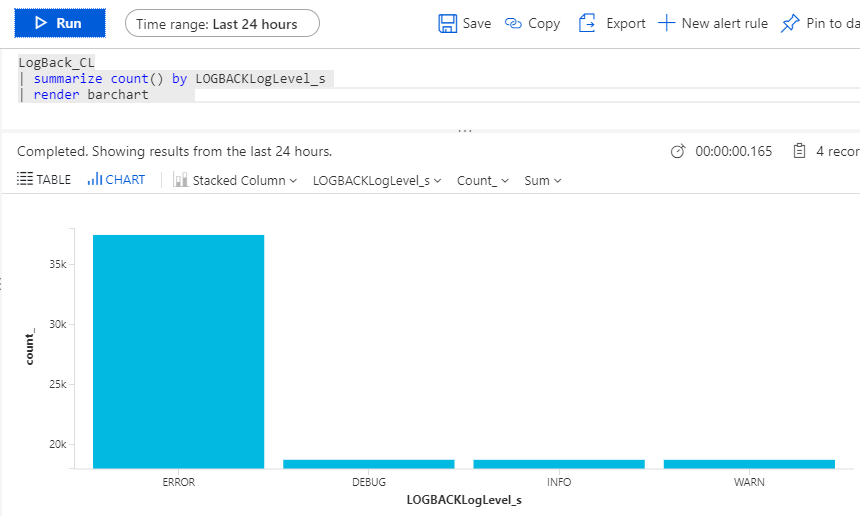

# Experimental logback appender for Log analytics (OMS)
This **experimental** appender collects data from logback and in async way sends data to OMS REST API for processing.

## How to compile and test
* go to directory `logbackomsappender`
* compile by `mvn clean install`
* than go to directory `testapp`
* update file `./src/main/resources/logback.xml` 
  * enter valid `customerId` and `sharedKey` - vaules depends on your deployed OMS instance
  * eventually define different batch size for uploading to Log Analytics in `batchSize`
  * create directory for temporary log files (in case when Log Analytics REST API is not accessible appender will save serialized messages to filesystem and sends these files when Log Analytics become available), enter valid path to `tempPath` 

```xml
<configuration>
    <appender name="STDOUT" class="ch.qos.logback.core.ConsoleAppender">
        <!-- encoders are assigned the type
             ch.qos.logback.classic.encoder.PatternLayoutEncoder by default -->
        <encoder>
            <pattern>%d{HH:mm:ss.SSS} [%thread] %-5level %logger{36} - %msg%n</pattern>
        </encoder>
    </appender>
    <appender name="OMS" class="com.microsoft.valda.oms.OmsAppender">
        <customerId>xxxxxxxx-xxxx-xxxx-xxxx-xxxxxxxxxxxx</customerId>
        <sharedKey>xxxxxxxxxxxxxxx==</sharedKey>
        <logType>LogBack</logType>
        <batchSize>1000</batchSize>
        <tempPath>/tmp/oms</tempPath>
    </appender>
    <root level="debug">
        <appender-ref ref="STDOUT" />
        <appender-ref ref="OMS" />
    </root>
</configuration>
```

* compile by `mvn clean package`
* and run our testapp ...

after while you will see in OMS some cool new records of your custom type from application ...




